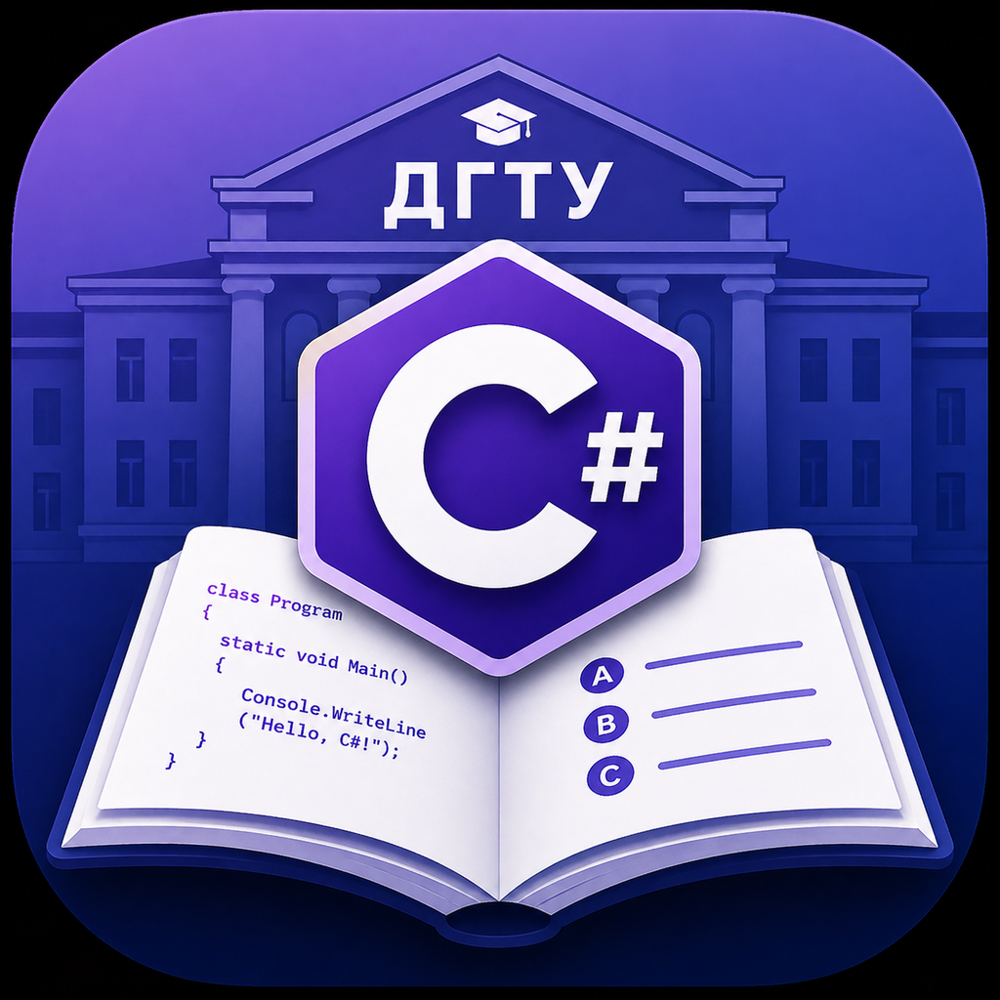
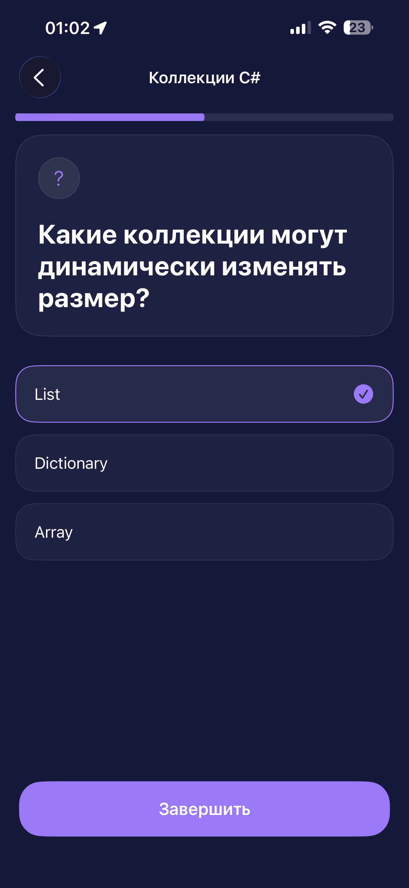
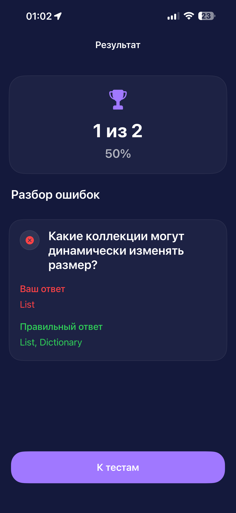

<div align="center">



# SharpTest

### Native iOS application for learning C# through interactive quizzes

Built with **Swift**, **UIKit**, **MVVM**, and the **Coordinator** pattern.

Programmatic UI • UIKit • Clean Architecture • No Storyboards (except Launch Screen)

</div>

---

# 📱 Screenshots

<p align="center">
  
  
  
</p>

---

# ✨ Features

- 📚 Browse available C# quizzes
- 📝 Interactive quiz interface
- ✅ Support for multiple correct answers
- 📈 Quiz progress tracking
- 🎯 Result screen with score summary
- 💾 Local storage using UserDefaults
- 🧩 Fully programmatic UIKit interface
- 🏛 MVVM architecture
- 🧭 Coordinator-based navigation

---

# 🛠 Tech Stack

| Category | Technologies |
|----------|--------------|
| Language | Swift |
| UI | UIKit |
| Architecture | MVVM |
| Navigation | Coordinator Pattern |
| Layout | Auto Layout |
| Storage | UserDefaults |
| Design Patterns | Repository Pattern |

---

# 🏛 Architecture

The application follows the **MVVM** architecture with the **Coordinator** pattern responsible for navigation.

```
AppCoordinator
      │
      ▼
TestsCoordinator
      │
      ▼
ViewController
      │
      ▼
ViewModel
      │
      ▼
QuizService
      │
      ▼
Repository
      │
      ▼
UserDefaults
```

---

# 📂 Project Structure

```text
SharpTest
│
├── App
├── Data
├── Design
├── Extensions
├── Models
├── Navigation
├── Repositories
├── Services
├── Storage
├── ViewControllers
├── ViewModels
└── Views
```

---

# 🚀 Getting Started

## Requirements

- macOS
- Xcode 16+
- iOS 18+

## Clone the repository

```bash
git clone https://github.com/VWalkerFPS/SharpTest.git
```

## Open the project

```
SharpTest.xcodeproj
```

## Run

Build and run the application in Xcode.

---

# 🗺 Roadmap

- [x] MVVM architecture
- [x] Coordinator navigation
- [x] Repository pattern
- [x] Local storage
- [x] Programmatic UIKit UI
- [ ] REST API integration
- [ ] User authentication
- [ ] Quiz history
- [ ] Statistics screen
- [ ] Dark Mode
- [ ] Unit Tests
- [ ] SwiftData / CoreData

---

# 📖 What I Learned

During the development of this project I practiced:

- Building a UIKit application without Storyboards
- Designing an application using MVVM
- Separating navigation with the Coordinator pattern
- Managing application state with ViewModels
- Working with Auto Layout programmatically
- Organizing code using Repository and Service layers
- Persisting local data with UserDefaults

---

# 👨‍💻 Author

**Dmitry Chebotarev**

Junior iOS Developer

Swift • UIKit • MVVM • Coordinator

---

## License

This project was created for educational and portfolio purposes.
